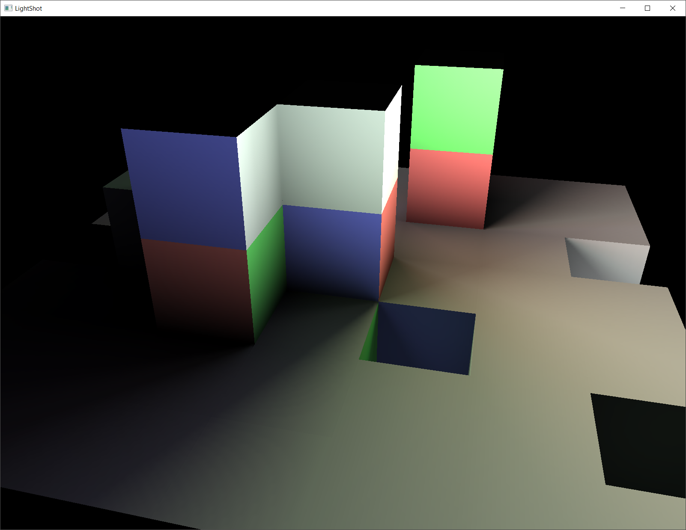
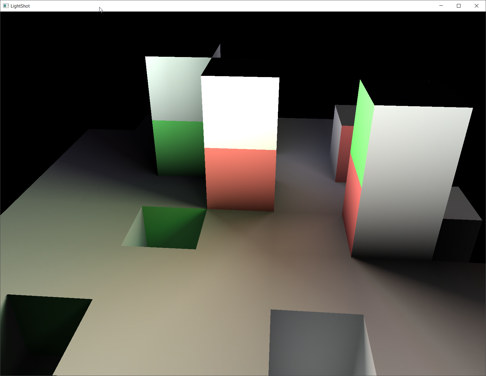
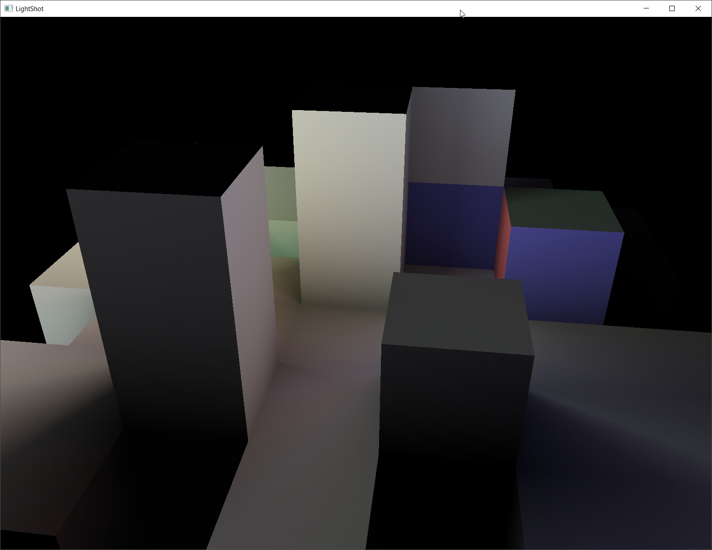

# Lightshot

A CPU-based (naïve) photon tracer.

```
[lightshot] a CPU-based photon tracer

usage: Lightshot resolution (must be a power of two, default is 16)
press 'space' key to toggle between linear/nearest texture filter

press 'esc' key to exit

117 plates, resolution: 32x32
material light retransmission rate: 50%
pass 1/4 - 1024 photon(s)
pass 2/4 - 56402 photon(s)
pass 3/4 - 96505 photon(s)
pass 4/4 - 110621 photon(s)
computation duration: 20m 13s 740ms
```





